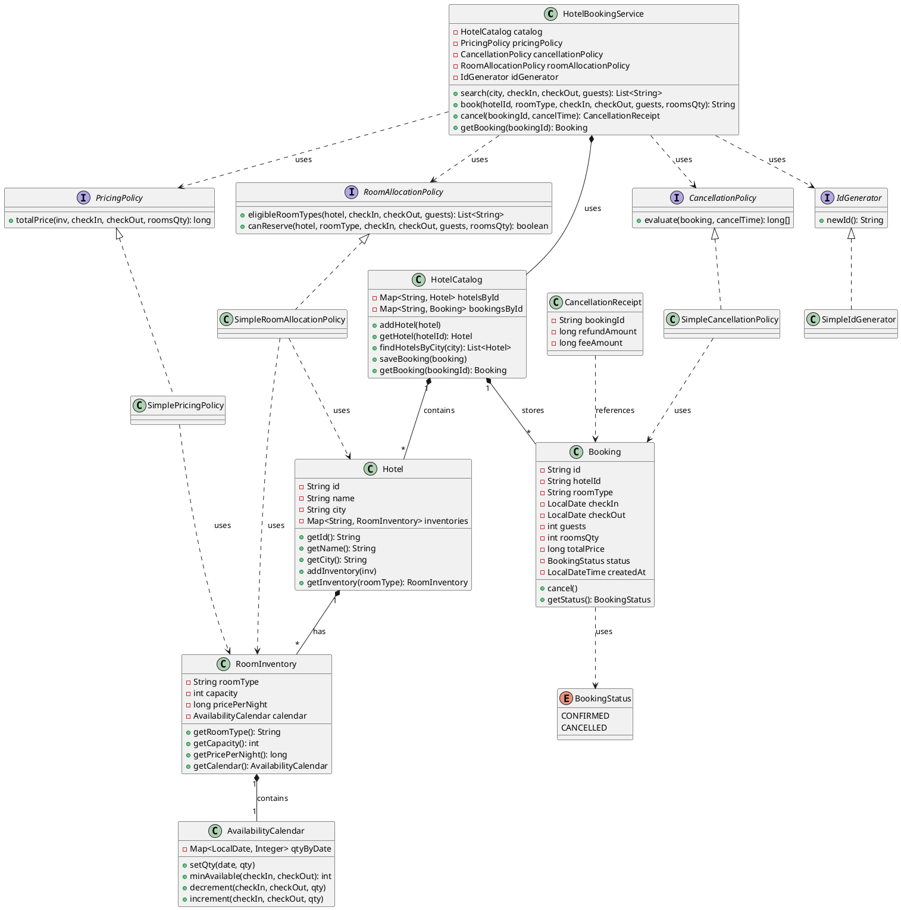

# Class Diagram for Hotel Booking System

```plantuml
@startuml HotelBookingClassDiagram

' Orchestrator
class HotelBookingService {
  - HotelCatalog catalog
  - PricingPolicy pricingPolicy
  - CancellationPolicy cancellationPolicy
  - RoomAllocationPolicy roomAllocationPolicy
  - IdGenerator idGenerator
  + search(city, checkIn, checkOut, guests): List<String>
  + book(hotelId, roomType, checkIn, checkOut, guests, roomsQty): String
  + cancel(bookingId, cancelTime): CancellationReceipt
  + getBooking(bookingId): Booking
}

' Domain Classes
class HotelCatalog {
  - Map<String, Hotel> hotelsById
  - Map<String, Booking> bookingsById
  + addHotel(hotel)
  + getHotel(hotelId): Hotel
  + findHotelsByCity(city): List<Hotel>
  + saveBooking(booking)
  + getBooking(bookingId): Booking
}

class Hotel {
  - String id
  - String name
  - String city
  - Map<String, RoomInventory> inventories
  + getId(): String
  + getName(): String
  + getCity(): String
  + addInventory(inv)
  + getInventory(roomType): RoomInventory
}

class RoomInventory {
  - String roomType
  - int capacity
  - long pricePerNight
  - AvailabilityCalendar calendar
  + getRoomType(): String
  + getCapacity(): int
  + getPricePerNight(): long
  + getCalendar(): AvailabilityCalendar
}

class AvailabilityCalendar {
  - Map<LocalDate, Integer> qtyByDate
  + setQty(date, qty)
  + minAvailable(checkIn, checkOut): int
  + decrement(checkIn, checkOut, qty)
  + increment(checkIn, checkOut, qty)
}

class Booking {
  - String id
  - String hotelId
  - String roomType
  - LocalDate checkIn
  - LocalDate checkOut
  - int guests
  - int roomsQty
  - long totalPrice
  - BookingStatus status
  - LocalDateTime createdAt
  + cancel()
  + getStatus(): BookingStatus
}

enum BookingStatus {
  CONFIRMED
  CANCELLED
}

class CancellationReceipt {
  - String bookingId
  - long refundAmount
  - long feeAmount
}

' Policy Interfaces
interface RoomAllocationPolicy {
  + eligibleRoomTypes(hotel, checkIn, checkOut, guests): List<String>
  + canReserve(hotel, roomType, checkIn, checkOut, guests, roomsQty): boolean
}

interface PricingPolicy {
  + totalPrice(inv, checkIn, checkOut, roomsQty): long
}

interface CancellationPolicy {
  + evaluate(booking, cancelTime): long[]
}

interface IdGenerator {
  + newId(): String
}

' Policy Implementations
class SimpleRoomAllocationPolicy implements RoomAllocationPolicy
class SimplePricingPolicy implements PricingPolicy
class SimpleCancellationPolicy implements CancellationPolicy
class SimpleIdGenerator implements IdGenerator

' Relationships
HotelBookingService *-- HotelCatalog : uses
HotelBookingService ..> RoomAllocationPolicy : uses
HotelBookingService ..> PricingPolicy : uses
HotelBookingService ..> CancellationPolicy : uses
HotelBookingService ..> IdGenerator : uses

HotelCatalog "1" *-- "*" Hotel : contains
HotelCatalog "1" *-- "*" Booking : stores

Hotel "1" *-- "*" RoomInventory : has
RoomInventory "1" *-- "1" AvailabilityCalendar : contains

Booking ..> BookingStatus : uses
CancellationReceipt ..> Booking : references

SimpleRoomAllocationPolicy ..> Hotel : uses
SimpleRoomAllocationPolicy ..> RoomInventory : uses
SimplePricingPolicy ..> RoomInventory : uses
SimpleCancellationPolicy ..> Booking : uses

@enduml
```
