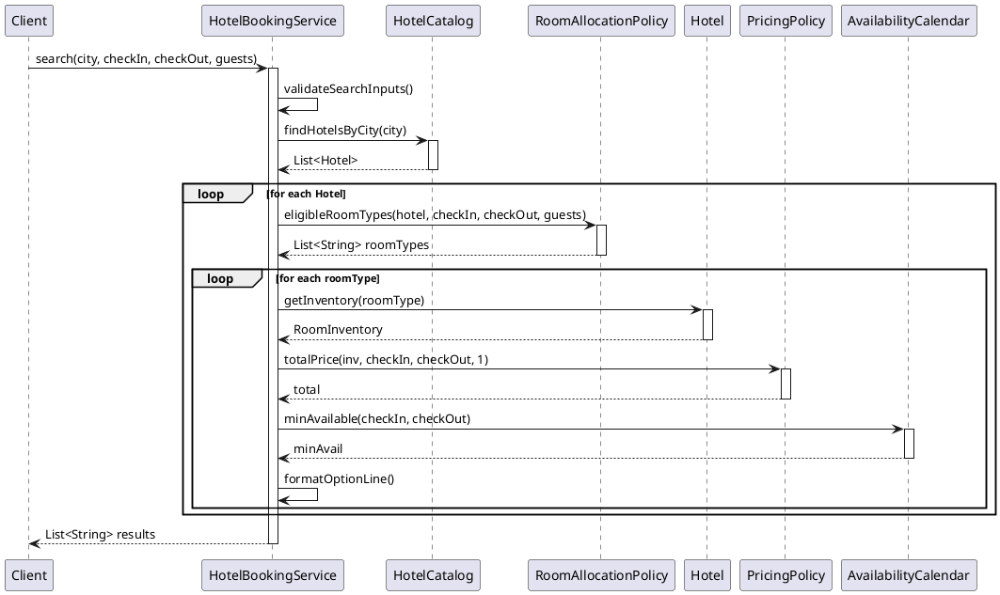
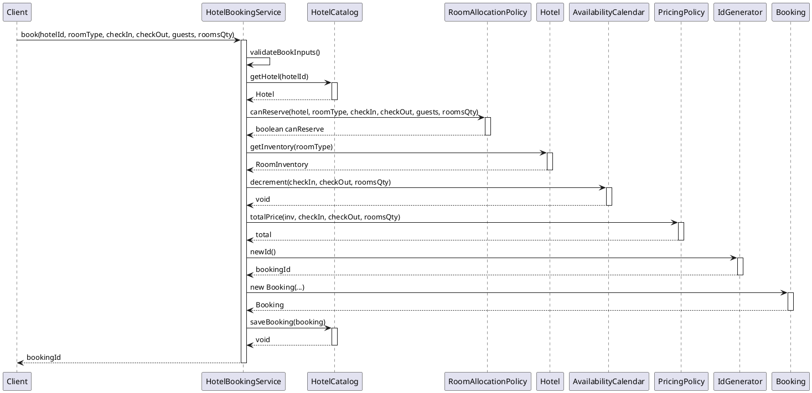
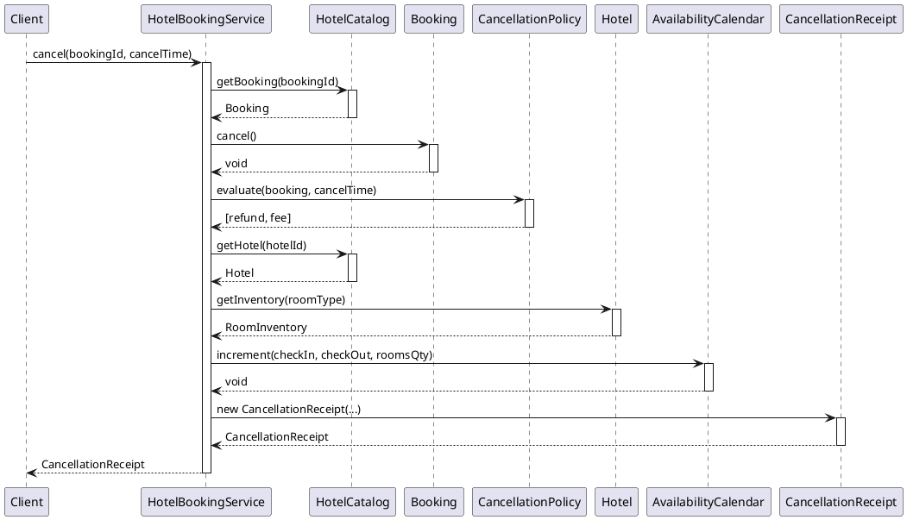

# Sequence Diagrams for HotelBookingService

## 1. Search Operation

```plantuml
@startuml Search
Client -> HotelBookingService: search(city, checkIn, checkOut, guests)
activate HotelBookingService

HotelBookingService -> HotelBookingService: validateSearchInputs()
HotelBookingService -> HotelCatalog: findHotelsByCity(city)
activate HotelCatalog
HotelCatalog --> HotelBookingService: List<Hotel>
deactivate HotelCatalog

loop for each Hotel
    HotelBookingService -> RoomAllocationPolicy: eligibleRoomTypes(hotel, checkIn, checkOut, guests)
    activate RoomAllocationPolicy
    RoomAllocationPolicy --> HotelBookingService: List<String> roomTypes
    deactivate RoomAllocationPolicy
    
    loop for each roomType
        HotelBookingService -> Hotel: getInventory(roomType)
        activate Hotel
        Hotel --> HotelBookingService: RoomInventory
        deactivate Hotel
        
        HotelBookingService -> PricingPolicy: totalPrice(inv, checkIn, checkOut, 1)
        activate PricingPolicy
        PricingPolicy --> HotelBookingService: total
        deactivate PricingPolicy
        
        HotelBookingService -> AvailabilityCalendar: minAvailable(checkIn, checkOut)
        activate AvailabilityCalendar
        AvailabilityCalendar --> HotelBookingService: minAvail
        deactivate AvailabilityCalendar
        
        HotelBookingService -> HotelBookingService: formatOptionLine()
    end
end

HotelBookingService --> Client: List<String> results
deactivate HotelBookingService
@enduml
```

## 2. Book Operation

```plantuml
@startuml Book
Client -> HotelBookingService: book(hotelId, roomType, checkIn, checkOut, guests, roomsQty)
activate HotelBookingService

HotelBookingService -> HotelBookingService: validateBookInputs()
HotelBookingService -> HotelCatalog: getHotel(hotelId)
activate HotelCatalog
HotelCatalog --> HotelBookingService: Hotel
deactivate HotelCatalog

HotelBookingService -> RoomAllocationPolicy: canReserve(hotel, roomType, checkIn, checkOut, guests, roomsQty)
activate RoomAllocationPolicy
RoomAllocationPolicy --> HotelBookingService: boolean canReserve
deactivate RoomAllocationPolicy

HotelBookingService -> Hotel: getInventory(roomType)
activate Hotel
Hotel --> HotelBookingService: RoomInventory
deactivate Hotel

HotelBookingService -> AvailabilityCalendar: decrement(checkIn, checkOut, roomsQty)
activate AvailabilityCalendar
AvailabilityCalendar --> HotelBookingService: void
deactivate AvailabilityCalendar

HotelBookingService -> PricingPolicy: totalPrice(inv, checkIn, checkOut, roomsQty)
activate PricingPolicy
PricingPolicy --> HotelBookingService: total
deactivate PricingPolicy

HotelBookingService -> IdGenerator: newId()
activate IdGenerator
IdGenerator --> HotelBookingService: bookingId
deactivate IdGenerator

HotelBookingService -> Booking: new Booking(...)
activate Booking
Booking --> HotelBookingService: Booking
deactivate Booking

HotelBookingService -> HotelCatalog: saveBooking(booking)
activate HotelCatalog
HotelCatalog --> HotelBookingService: void
deactivate HotelCatalog

HotelBookingService --> Client: bookingId
deactivate HotelBookingService
@enduml
```

## 3. Cancel Operation

```plantuml
@startuml Cancel
Client -> HotelBookingService: cancel(bookingId, cancelTime)
activate HotelBookingService

HotelBookingService -> HotelCatalog: getBooking(bookingId)
activate HotelCatalog
HotelCatalog --> HotelBookingService: Booking
deactivate HotelCatalog

HotelBookingService -> Booking: cancel()
activate Booking
Booking --> HotelBookingService: void
deactivate Booking

HotelBookingService -> CancellationPolicy: evaluate(booking, cancelTime)
activate CancellationPolicy
CancellationPolicy --> HotelBookingService: [refund, fee]
deactivate CancellationPolicy

HotelBookingService -> HotelCatalog: getHotel(hotelId)
activate HotelCatalog
HotelCatalog --> HotelBookingService: Hotel
deactivate HotelCatalog

HotelBookingService -> Hotel: getInventory(roomType)
activate Hotel
Hotel --> HotelBookingService: RoomInventory
deactivate Hotel

HotelBookingService -> AvailabilityCalendar: increment(checkIn, checkOut, roomsQty)
activate AvailabilityCalendar
AvailabilityCalendar --> HotelBookingService: void
deactivate AvailabilityCalendar

HotelBookingService -> CancellationReceipt: new CancellationReceipt(...)
activate CancellationReceipt
CancellationReceipt --> HotelBookingService: CancellationReceipt
deactivate CancellationReceipt

HotelBookingService --> Client: CancellationReceipt
deactivate HotelBookingService
@enduml
```
