# Parking Lot System - Complete Class Diagram

## Mermaid Class Diagram

```mermaid
classDiagram
    %% Domain Classes
    class Vehicle {
        -String vehicleNumber
        -VehicleType type
        +Vehicle(String vehicleNumber, VehicleType type)
        +String getVehicleNumber()
        +VehicleType getType()
    }

    class ParkingLot {
        -String lotId
        -List~ParkingFloor~ floors
        -Map~String,ParkingSpot~ spotById
        +ParkingLot(String lotId, List~ParkingFloor~ floors)
        +String getLotId()
        +List~ParkingFloor~ getFloors()
        +ParkingSpot getSpotById(String spotId)
    }

    class ParkingFloor {
        -String floorId
        -List~ParkingSpot~ spots
        +ParkingFloor(String floorId, List~ParkingSpot~ spots)
        +String getFloorId()
        +List~ParkingSpot~ getSpots()
    }

    class ParkingSpot {
        -String spotId
        -VehicleType spotType
        -boolean occupied
        -Vehicle parkedVehicle
        +ParkingSpot(String spotId, VehicleType spotType)
        +String getSpotId()
        +VehicleType getSpotType()
        +boolean isOccupied()
        +boolean isFree()
        +Vehicle getParkedVehicle()
        +void occupy(Vehicle vehicle)
        +void vacate()
    }

    class Ticket {
        -String ticketId
        -String vehicleNumber
        -VehicleType vehicleType
        -String spotId
        -long entryTimeMillis
        -TicketStatus status
        -Long exitTimeMillis
        -Double feePaid
        +Ticket(String ticketId, String vehicleNumber, VehicleType vehicleType, String spotId, long entryTimeMillis)
        +String getTicketId()
        +String getVehicleNumber()
        +VehicleType getVehicleType()
        +String getSpotId()
        +long getEntryTimeMillis()
        +TicketStatus getStatus()
        +Long getExitTimeMillis()
        +Double getFeePaid()
        +boolean isActive()
        +void close(long exitTimeMillis, double feePaid)
    }

    %% Enums
    class VehicleType {
        <<enumeration>>
        BIKE
        CAR
        TRUCK
    }

    class TicketStatus {
        <<enumeration>>
        ACTIVE
        CLOSED
    }

    %% Service
    class ParkingLotService {
        -ParkingLot parkingLot
        -SpotAllocationPolicy allocationPolicy
        -FeeCalculationPolicy feePolicy
        -Clock clock
        -TicketIdGenerator ticketIdGenerator
        -Map~String,Ticket~ activeTickets
        -Map~String,Ticket~ closedTickets
        +ParkingLotService(ParkingLot parkingLot, SpotAllocationPolicy allocationPolicy, FeeCalculationPolicy feePolicy, Clock clock, TicketIdGenerator ticketIdGenerator)
        +Ticket park(Vehicle vehicle)
        +double unpark(String ticketId)
        +int getActiveTicketCount()
    }

    %% Policy Interfaces
    class SpotAllocationPolicy {
        <<interface>>
        +ParkingSpot findSpot(ParkingLot lot, Vehicle vehicle)
    }

    class FeeCalculationPolicy {
        <<interface>>
        +double calculateFee(Ticket ticket, long exitTimeMillis)
    }

    class RateCard {
        -Map~VehicleType,Double~ hourlyRateByType
        +RateCard(double bikePerHour, double carPerHour, double truckPerHour)
        +double ratePerHour(VehicleType type)
    }

    %% Policy Implementations
    class FirstAvailableSpotPolicy {
        +ParkingSpot findSpot(ParkingLot lot, Vehicle vehicle)
    }

    class HourlyFeePolicy {
        -RateCard rateCard
        -static long ONE_HOUR_MILLIS
        +HourlyFeePolicy(RateCard rateCard)
        +double calculateFee(Ticket ticket, long exitTimeMillis)
    }

    %% Utility Interfaces
    class Clock {
        <<interface>>
        +long nowMillis()
    }

    class TicketIdGenerator {
        <<interface>>
        +String nextId()
    }

    %% Utility Implementations
    class SystemClock {
        +long nowMillis()
    }

    class FakeClock {
        -long now
        +FakeClock(long startMillis)
        +long nowMillis()
        +void advanceMillis(long delta)
    }

    class UuidTicketIdGenerator {
        +String nextId()
    }

    %% Exceptions
    class RuntimeException {
        <<exception>>
    }

    class InvalidTicketException {
        +InvalidTicketException(String message)
    }

    class NoSpotAvailableException {
        +NoSpotAvailableException(String message)
    }

    class SpotAlreadyFreeException {
        +SpotAlreadyFreeException(String message)
    }

    class SpotAlreadyOccupiedException {
        +SpotAlreadyOccupiedException(String message)
    }

    class SpotTypeMismatchException {
        +SpotTypeMismatchException(String message)
    }

    class TicketAlreadyClosedException {
        +TicketAlreadyClosedException(String message)
    }

    %% Domain Relationships - Composition
    ParkingLot "1" *-- "many" ParkingFloor : contains
    ParkingFloor "1" *-- "many" ParkingSpot : contains
    
    %% Domain Relationships - Association
    ParkingSpot "0..1" --> "1" Vehicle : parkedVehicle
    ParkingSpot --> VehicleType : uses
    Vehicle --> VehicleType : uses
    Ticket --> VehicleType : uses
    Ticket --> TicketStatus : uses
    Ticket --> ParkingSpot : references (spotId)

    %% Service Relationships
    ParkingLotService --> ParkingLot : uses
    ParkingLotService --> SpotAllocationPolicy : uses
    ParkingLotService --> FeeCalculationPolicy : uses
    ParkingLotService --> Clock : uses
    ParkingLotService --> TicketIdGenerator : uses
    ParkingLotService "1" *-- "many" Ticket : manages

    %% Policy Relationships - Implementation
    SpotAllocationPolicy <|.. FirstAvailableSpotPolicy : implements
    FeeCalculationPolicy <|.. HourlyFeePolicy : implements
    
    %% Policy Relationships - Usage
    HourlyFeePolicy --> RateCard : uses
    SpotAllocationPolicy --> ParkingLot : uses
    SpotAllocationPolicy --> Vehicle : uses
    FeeCalculationPolicy --> Ticket : uses
    RateCard --> VehicleType : uses

    %% Utility Relationships - Implementation
    Clock <|.. SystemClock : implements
    Clock <|.. FakeClock : implements
    TicketIdGenerator <|.. UuidTicketIdGenerator : implements

    %% Exception Relationships - Inheritance
    RuntimeException <|-- InvalidTicketException : extends
    RuntimeException <|-- NoSpotAvailableException : extends
    RuntimeException <|-- SpotAlreadyFreeException : extends
    RuntimeException <|-- SpotAlreadyOccupiedException : extends
    RuntimeException <|-- SpotTypeMismatchException : extends
    RuntimeException <|-- TicketAlreadyClosedException : extends

    %% Exception Dependencies (thrown by)
    ParkingLotService ..> InvalidTicketException : throws
    ParkingLotService ..> NoSpotAvailableException : throws
    ParkingLotService ..> TicketAlreadyClosedException : throws
    ParkingSpot ..> SpotAlreadyOccupiedException : throws
    ParkingSpot ..> SpotTypeMismatchException : throws
    ParkingSpot ..> SpotAlreadyFreeException : throws
    Ticket ..> TicketAlreadyClosedException : throws
```

## Class Diagram Summary

### Domain Layer
- **Vehicle**: Represents a vehicle with number and type
- **ParkingLot**: Contains multiple floors
- **ParkingFloor**: Contains multiple parking spots
- **ParkingSpot**: Individual parking spot that can be occupied by a vehicle
- **Ticket**: Represents a parking ticket with entry/exit times and fee
- **VehicleType**: Enum (BIKE, CAR, TRUCK)
- **TicketStatus**: Enum (ACTIVE, CLOSED)

### Service Layer
- **ParkingLotService**: Main service orchestrating parking operations (park/unpark)

### Policy Layer (Strategy Pattern)
- **SpotAllocationPolicy**: Interface for spot allocation strategies
- **FirstAvailableSpotPolicy**: Implementation finding first available spot
- **FeeCalculationPolicy**: Interface for fee calculation strategies
- **HourlyFeePolicy**: Implementation calculating hourly fees
- **RateCard**: Contains hourly rates per vehicle type

### Utility Layer
- **Clock**: Interface for time operations
- **SystemClock**: Real-time clock implementation
- **FakeClock**: Test clock with controllable time
- **TicketIdGenerator**: Interface for ticket ID generation
- **UuidTicketIdGenerator**: UUID-based ticket ID generator

### Exception Layer
All custom exceptions extend `RuntimeException`:
- **InvalidTicketException**: Invalid ticket ID provided
- **NoSpotAvailableException**: No parking spot available
- **SpotAlreadyFreeException**: Attempting to vacate already free spot
- **SpotAlreadyOccupiedException**: Attempting to occupy already occupied spot
- **SpotTypeMismatchException**: Vehicle type doesn't match spot type
- **TicketAlreadyClosedException**: Attempting to close already closed ticket

## Key Relationships

1. **Composition**: ParkingLot → ParkingFloor → ParkingSpot (strong ownership)
2. **Association**: ParkingSpot → Vehicle (weak reference, can be null)
3. **Dependency**: Service depends on policies and utilities (injected via constructor)
4. **Implementation**: Policy implementations follow Strategy pattern
5. **Inheritance**: All exceptions extend RuntimeException
