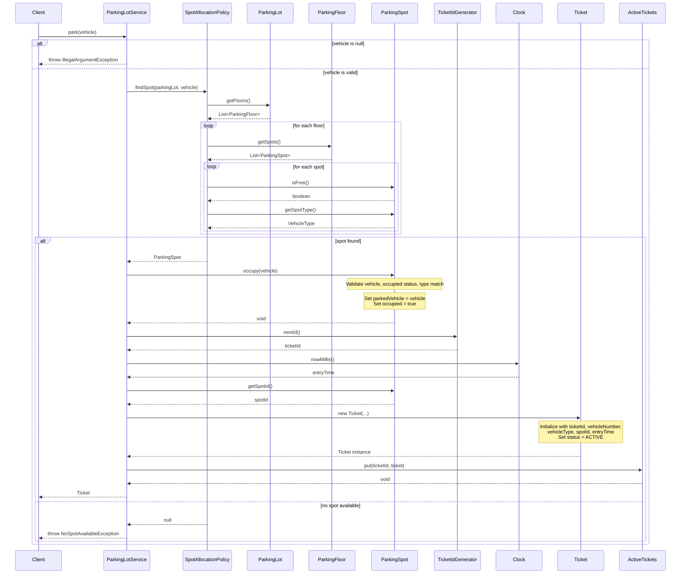
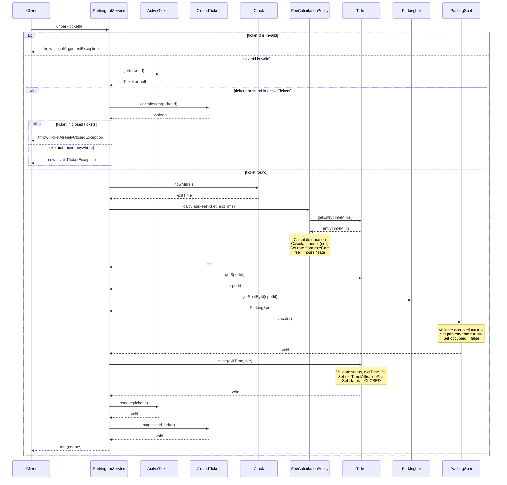

# Parking Lot - Sequence Diagrams

## park() Method Sequence Diagram

## unpark() Method Sequence Diagram

## Key Interactions Summary

### park() Flow:
1. **Validation**: Validate vehicle input
2. **Spot Allocation**: Use allocation policy to find available spot
3. **Spot Occupation**: Occupy the found spot with vehicle
4. **Ticket Creation**: Generate ticket ID, get entry time, create ticket
5. **Registration**: Store ticket in active tickets registry
6. **Return**: Return ticket to client

### unpark() Flow:
1. **Validation**: Validate ticket ID input
2. **Ticket Lookup**: Find ticket in active tickets registry
3. **Fee Calculation**: Calculate parking fee based on duration
4. **Spot Vacating**: Free the parking spot
5. **Ticket Closure**: Close the ticket with exit time and fee
6. **Registry Update**: Move ticket from active to closed registry
7. **Return**: Return calculated fee to client
