# Splitwise Service – Class Diagram

Class diagram for the Splitwise LLD, from **MainDemo** entry point through **SplitwiseService** and all domain/policy types.

---

## Mermaid class diagram

```mermaid
classDiagram
    direction TB

    %% ========== Demo (entry) ==========
    class MainDemo {
        +main(String[] args)$
        -money(long paise)$
        -printBalances(String, Map, Map)$
        -printSimplified(String, List~TransferSuggestion~, Map)$
    }

    %% ========== Orchestrator ==========
    class SplitwiseService {
        -SplitwiseCatalog catalog
        -SplitPolicyFactory splitPolicyFactory
        -DebtSimplificationPolicyFactory debtPolicyFactory
        +SplitwiseService(catalog, splitPolicyFactory, debtPolicyFactory)
        +createUser(String name) String
        +createGroup(String name, List~String~ memberUserIds, DebtSimplifyMode mode) String
        +addExpense(groupId, payerId, totalPaise, SplitType, List~SplitInput~, note) String
        +getBalances(String groupId) Map~String,Long~
        +getSimplifiedDebts(String groupId) List~TransferSuggestion~
        +settleUp(groupId, fromUserId, toUserId, amountPaise) String
    }

    %% ========== Domain – Catalog & core entities ==========
    class SplitwiseCatalog {
        +List~User~ users
        +List~Group~ groups
        +addUser(User u)
        +addGroup(Group g)
        +findUserById(String userId) User
        +findGroupById(String groupId) Group
    }

    class User {
        +String id
        +String name
        +User(String id, String name)
    }

    class Group {
        +String id
        +String name
        +List~String~ memberUserIds
        +List~Expense~ expenses
        +List~Settlement~ settlements
        +Ledger ledger
        -DebtSimplifyMode simplifyMode
        +getSimplifyMode() DebtSimplifyMode
        +setSimplifyMode(DebtSimplifyMode)
        +hasMember(String userId) boolean
        +addMember(String userId)
        +addExpense(Expense e)
        +addSettlement(Settlement s)
        +Group(String id, String name)
    }

    class Ledger {
        -Map~String,Long~ netBalance
        +applyExpense(Expense e)
        applySettlement(Settlement s)
        +getNetPaise(String userId) long
        +snapshot() Map~String,Long~
        ensureMemberInitialized(String userId)
    }

    class Expense {
        +String id
        +String groupId
        +String payerId
        +long totalPaise
        +List~SplitLine~ lines
        +String note
        +long createdAtEpochMs
        +Expense(...)
    }

    class Settlement {
        +String id
        +String groupId
        +String fromUserId
        +String toUserId
        +long amountPaise
        +long createdAtEpochMs
        +Settlement(...)
    }

    %% ========== Domain – Split I/O & suggestions ==========
    class SplitInput {
        +String userId
        +long value
        +SplitInput(String userId, long value)
    }

    class SplitLine {
        +String userId
        +long owedPaise
        +SplitLine(String userId, long owedPaise)
    }

    class TransferSuggestion {
        +String fromUserId
        +String toUserId
        +long amountPaise
        +TransferSuggestion(String, String, long)
    }

    %% ========== Enums ==========
    class SplitType {
        <<enumeration>>
        EQUAL
        EXACT
        PERCENT
        SHARE
    }

    class DebtSimplifyMode {
        <<enumeration>>
        GREEDY_FAST
        MIN_TRANSFERS
    }

    %% ========== Policy interfaces ==========
    class SplitPolicy {
        <<interface>>
        +validate(long totalPaise, String payerId, List~SplitInput~ inputs)
        +compute(long totalPaise, String payerId, List~SplitInput~ inputs) List~SplitLine~
    }

    class DebtSimplificationPolicy {
        <<interface>>
        +simplify(Map~String,Long~ netBalances) List~TransferSuggestion~
    }

    %% ========== Policy factories ==========
    class SplitPolicyFactory {
        -SplitPolicy equal
        -SplitPolicy exact
        -SplitPolicy percent
        -SplitPolicy share
        +get(SplitType type) SplitPolicy
    }

    class DebtSimplificationPolicyFactory {
        -DebtSimplificationPolicy greedy
        -DebtSimplificationPolicy minTransfers
        +get(DebtSimplifyMode mode) DebtSimplificationPolicy
    }

    %% ========== Policy implementations ==========
    class EqualSplitPolicy {
        +validate(...)
        +compute(...) List~SplitLine~
    }
    class ExactSplitPolicy {
        +validate(...)
        +compute(...) List~SplitLine~
    }
    class PercentSplitPolicy {
        +validate(...)
        +compute(...) List~SplitLine~
    }
    class ShareSplitPolicy {
        +validate(...)
        +compute(...) List~SplitLine~
    }
    class GreedyDebtSimplificationPolicy {
        +simplify(Map) List~TransferSuggestion~
    }
    class MinTransfersDebtSimplificationPolicy {
        +simplify(Map) List~TransferSuggestion~
    }

    %% ========== Relationships ==========
    MainDemo ..> SplitwiseService : uses
    MainDemo ..> SplitwiseCatalog : creates
    MainDemo ..> SplitPolicyFactory : creates
    MainDemo ..> DebtSimplificationPolicyFactory : creates
    MainDemo ..> SplitInput : uses
    MainDemo ..> SplitType : uses
    MainDemo ..> DebtSimplifyMode : uses
    MainDemo ..> TransferSuggestion : uses

    SplitwiseService --> SplitwiseCatalog : owns
    SplitwiseService --> SplitPolicyFactory : owns
    SplitwiseService --> DebtSimplificationPolicyFactory : owns
    SplitwiseService ..> User : creates
    SplitwiseService ..> Group : creates
    SplitwiseService ..> Expense : creates
    SplitwiseService ..> Settlement : creates
    SplitwiseService ..> SplitPolicy : uses
    SplitwiseService ..> DebtSimplificationPolicy : uses
    SplitwiseService ..> SplitInput : uses
    SplitwiseService ..> SplitLine : uses
    SplitwiseService ..> SplitType : uses
    SplitwiseService ..> DebtSimplifyMode : uses
    SplitwiseService ..> TransferSuggestion : returns

    SplitwiseCatalog "1" *-- "0..*" User : contains
    SplitwiseCatalog "1" *-- "0..*" Group : contains

    Group "1" *-- "1" Ledger : has
    Group "1" *-- "0..*" Expense : has
    Group "1" *-- "0..*" Settlement : has
    Group ..> DebtSimplifyMode : uses

    Ledger ..> Expense : applyExpense
    Ledger ..> Settlement : applySettlement

    Expense "1" *-- "0..*" SplitLine : has

    SplitPolicyFactory ..> SplitType : keyed by
    SplitPolicyFactory *-- EqualSplitPolicy : creates
    SplitPolicyFactory *-- ExactSplitPolicy : creates
    SplitPolicyFactory *-- PercentSplitPolicy : creates
    SplitPolicyFactory *-- ShareSplitPolicy : creates
    SplitPolicyFactory ..> SplitPolicy : returns

    DebtSimplificationPolicyFactory ..> DebtSimplifyMode : keyed by
    DebtSimplificationPolicyFactory *-- GreedyDebtSimplificationPolicy : creates
    DebtSimplificationPolicyFactory *-- MinTransfersDebtSimplificationPolicy : creates
    DebtSimplificationPolicyFactory ..> DebtSimplificationPolicy : returns

    EqualSplitPolicy --|> SplitPolicy : implements
    ExactSplitPolicy --|> SplitPolicy : implements
    PercentSplitPolicy --|> SplitPolicy : implements
    ShareSplitPolicy --|> SplitPolicy : implements

    GreedyDebtSimplificationPolicy --|> DebtSimplificationPolicy : implements
    MinTransfersDebtSimplificationPolicy --|> DebtSimplificationPolicy : implements

    SplitPolicy ..> SplitInput : consumes
    SplitPolicy ..> SplitLine : produces
    DebtSimplificationPolicy ..> TransferSuggestion : produces
```

---

## Flow summary (MainDemo → SplitwiseService)

| Step | From | To | What |
|------|------|----|------|
| 1 | **MainDemo** | **SplitwiseCatalog**, **SplitPolicyFactory**, **DebtSimplificationPolicyFactory** | Creates catalog and factories. |
| 2 | **MainDemo** | **SplitwiseService** | Constructs service with catalog and factories. |
| 3 | **MainDemo** | **SplitwiseService** | `createUser` → **User** stored in **SplitwiseCatalog**. |
| 4 | **MainDemo** | **SplitwiseService** | `createGroup` → **Group** (with **Ledger**) stored in catalog. |
| 5 | **MainDemo** | **SplitwiseService** | `addExpense` → **SplitPolicyFactory** → **SplitPolicy** (EQUAL/EXACT/PERCENT) → **SplitLine**s → **Expense** → **Group.addExpense** → **Ledger.applyExpense**. |
| 6 | **MainDemo** | **SplitwiseService** | `getBalances` → **Group.ledger.snapshot()**. |
| 7 | **MainDemo** | **SplitwiseService** | `getSimplifiedDebts` → **DebtSimplificationPolicyFactory** → **DebtSimplificationPolicy** → **TransferSuggestion** list. |
| 8 | **MainDemo** | **SplitwiseService** | `settleUp` → **Settlement** → **Group.addSettlement** → **Ledger.applySettlement**. |

---

## Package layout

| Package | Types |
|---------|--------|
| **demo** | MainDemo |
| **orchestrator** | SplitwiseService |
| **domain** | SplitwiseCatalog, User, Group, Ledger, Expense, Settlement, SplitInput, SplitLine, TransferSuggestion |
| **domain.enums** | SplitType, DebtSimplifyMode |
| **policy** | SplitPolicy, DebtSimplificationPolicy, SplitPolicyFactory, DebtSimplificationPolicyFactory |
| **policy.impl** | EqualSplitPolicy, ExactSplitPolicy, PercentSplitPolicy, ShareSplitPolicy, GreedyDebtSimplificationPolicy, MinTransfersDebtSimplificationPolicy |

You can paste the Mermaid block into any Mermaid-capable viewer (e.g. GitHub, VS Code Mermaid extension, or [mermaid.live](https://mermaid.live)) to render the diagram.
