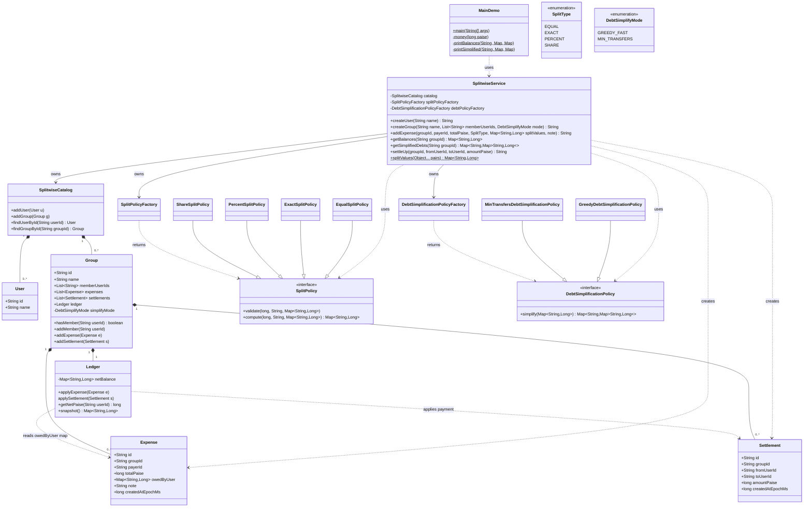

# Splitwise Service – Simplified Class Diagram

This version removes these separate classes:

- `SplitInput`
- `SplitLine`
- `TransferSuggestion`

Instead it uses simple maps:

- Split input: `Map<String, Long>`
- Expense split lines: `Map<String, Long>` inside `Expense`
- Simplified transfers: `Map<String, Map<String, Long>>`

---

